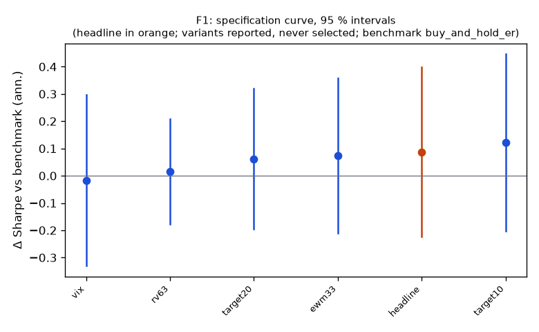

# Family F1

**Mechanism.** Variance is highly predictable at a one-month horizon while the equity premium is not proportionally higher when variance is high (Moreira & Muir 2017); scaling exposure by sigma*/sigma_hat, capped at 1 for a retail account, raises the Sharpe ratio and cuts drawdowns by de-risking in high-variance periods.

- Registered: e19b44f22d84e998031544bf49c375b348964d1b (2026-10-10); run at 2026-10-10T04:24:47.942235+00:00, code 7316610aa337, git 5b07cbe1ae18
- Instruments: DIA, IWM, QQQ, SPY (pooled, weights DIA 0.28, IWM 0.22, QQQ 0.22, SPY 0.28); window 2016-01-04 → 2025-10-01; benchmark buy_and_hold_er
- Trials: family 6 / budget 10; program 6 / 112 trials, 1 / 8 families

## Headline test

- Sharpe 0.92 vs benchmark 0.83 on 2400 days; difference 0.09 (95 % CI -0.22 … 0.40), Ledoit–Wolf p = 0.5462 (block 21 sessions)
- PSR(0) 0.997; DSR 0.992 (N = 6 program trials, V = 0.000038)
- Alpha 1.9 %/yr (NW t 1.13, p 0.2604), beta 0.62
- Floors: min_net_ret_vs_benchmark 0.115 vs 0.120 → FAIL; min_edge_to_cost 1773.858 vs 3.000 → ok
- Coherence: 5 variants, share with the headline's sign 0.80, median variant target20 (floors yes) → coherent
- Before Holm across families: p 0.5462, floors no, coherent yes, positive yes

## Specification curve (reported; no variant is selected)



| variant | status | start | days | sharpe | Δ vs bench | CI | p | Δ on headline days | net ret | max dd | floors |
|---|---|---|---|---|---|---|---|---|---|---|---|
| headline | ok | 2016-03-16 | 2400 | 0.92 | 0.09 | -0.22 … 0.40 | 0.5462 | — | 11.5 % | -19.1 % | no |
| rv63 | ok | 2016-04-05 | 2387 | 0.83 | 0.01 | -0.18 … 0.21 | 0.8661 | 0.01 | 10.8 % | -22.4 % | no |
| ewm33 | ok | 2016-03-16 | 2400 | 0.90 | 0.07 | -0.21 … 0.36 | 0.5892 | 0.07 | 10.9 % | -18.9 % | no |
| vix | ok | 2018-01-03 | 1946 | 0.68 | -0.02 | -0.33 … 0.30 | 0.9030 | -0.02 | 8.2 % | -19.0 % | no |
| target10 | ok | 2016-03-16 | 2400 | 0.95 | 0.12 | -0.20 … 0.45 | 0.4638 | 0.12 | 9.3 % | -13.6 % | no |
| target20 | ok | 2016-03-16 | 2400 | 0.89 | 0.06 | -0.20 … 0.32 | 0.6277 | 0.06 | 12.8 % | -22.5 % | yes |

Coherence reads each variant's Δ on the days it shares with the headline (column 'Δ on headline days'); the curve and the p-values are each variant's own sample.

**Skipped segments** (state could not be fit: no events there, flat days): vix: {'DIA': [1, 2, 3, 4, 5, 6, 7], 'IWM': [1, 2, 3, 4, 5, 6, 7], 'QQQ': [1, 2, 3, 4, 5, 6, 7], 'SPY': [1, 2, 3, 4, 5, 6, 7]}

## Responses

| variant | calmar | crisis_return | exposure | lpm2 | max_dd | sharpe | skew |
|---|---|---|---|---|---|---|---|
| headline | 0.603 | 2020-02-19..2020-03-24: -16.0 %; 2022-01-03..2022-10-13: -16.1 % | 1.000 | 0.093 | -0.191 | 0.917 | -0.635 |
| rv63 | 0.483 | 2020-02-19..2020-03-24: -19.7 %; 2022-01-03..2022-10-13: -16.8 % | 1.000 | 0.097 | -0.224 | 0.831 | -0.596 |
| ewm33 | 0.575 | 2020-02-19..2020-03-24: -16.1 %; 2022-01-03..2022-10-13: -16.2 % | 1.000 | 0.089 | -0.189 | 0.904 | -0.629 |
| vix | 0.428 | 2020-02-19..2020-03-24: -14.9 %; 2022-01-03..2022-10-13: -16.5 % | 0.999 | 0.093 | -0.190 | 0.681 | -0.642 |
| target10 | 0.686 | 2020-02-19..2020-03-24: -11.6 %; 2022-01-03..2022-10-13: -11.5 % | 1.000 | 0.072 | -0.136 | 0.951 | -0.687 |
| target20 | 0.569 | 2020-02-19..2020-03-24: -19.5 %; 2022-01-03..2022-10-13: -19.2 % | 1.000 | 0.106 | -0.225 | 0.892 | -0.581 |

## State splits (headline; reported with 95 % Newey–West intervals, not tested)

**vix_tercile**

| group | n_days | mean_bp | ci_bp | sharpe |
|---|---|---|---|---|
| high | 801 | 7.61 | 1.03 … 14.18 | 1.19 |
| low | 799 | 5.98 | 2.68 … 9.28 | 1.79 |
| mid | 800 | 0.39 | -5.18 … 5.95 | 0.08 |

**macro_day**

| group | n_days | mean_bp | ci_bp | sharpe |
|---|---|---|---|---|
| macro | 295 | 7.70 | -2.18 … 17.58 | 1.36 |
| other | 2105 | 4.23 | 1.08 … 7.38 | 0.85 |

**abs_move_tercile**

| group | n_days | mean_bp | ci_bp | sharpe |
|---|---|---|---|---|
| large | 800 | 5.94 | -2.51 … 14.40 | 0.73 |
| mid | 800 | 7.47 | 4.22 … 10.71 | 2.42 |
| small | 800 | 0.56 | -0.38 … 1.51 | 0.60 |

## Sample splits (headline; reported)

| split | n_days | sharpe | bench_sharpe | ret | max_dd | mean_bp |
|---|---|---|---|---|---|---|
| 2016_2019 | 956 | 1.24 | 1.22 | 65.6 % | -15.5 % | 5.53 |
| 2020_2025 | 1444 | 0.75 | 0.71 | 70.8 % | -19.1 % | 4.08 |
| tlt_gld | 2400 | 0.57 | 0.56 | 67.8 % | -27.5 % | 2.37 |

## Quasi-holdout slice (reported; never a gate)

*quasi-holdout 2025-10-01 → 2026-09-30: contaminated (the U11 holdout exposed these days' buy-and-hold outcomes before the families were chosen); a robustness slice, never a gate*

| slice | n_days | sharpe | bench_sharpe | ret | max_dd | mean_bp |
|---|---|---|---|---|---|---|
| 2025-10 → 2026-09 | 250 | 1.11 | 1.12 | 14.1 % | -8.6 % | 5.60 |

## Per-instrument headline Sharpe (raw and James–Stein shrunk toward the family mean)

| instrument | sharpe | sharpe_js |
|---|---|---|
| DIA | 0.89 | 0.87 |
| IWM | 0.46 | 0.64 |
| QQQ | 1.09 | 0.98 |
| SPY | 0.98 | 0.92 |

## Registered vs run spec

```
+registered: {sha: 'e19b44f22d84e998031544bf49c375b348964d1b', date: '2026-10-10'}
```
