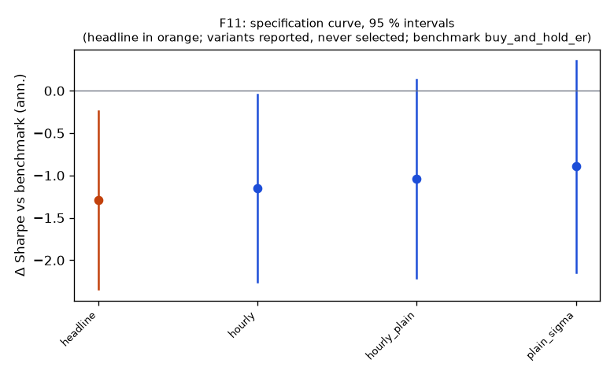

# Family F11

**Mechanism.** The ISOM time-of-day seasonality (Kablan 2009) makes a plain bar volatility wrong by a factor of several across the session, so CUSUM event timing and triple-barrier widths at 15Min–1Hour were mis-scaled in U11; if that labelling error hid an edge, deseasonalizing volatility should reveal it in the best-evidenced U11 cells.

- Registered: ce5dcd212158b1db4e8d02554eee667d42816222 (2026-10-10); run at 2026-10-10T07:14:24.099736+00:00, code e331b316c440, git 509f5f766cd7
- Instruments: QQQ, SPY, XLK (pooled, weights QQQ 0.32, SPY 0.39, XLK 0.29); window 2016-01-04 → 2025-10-01; benchmark buy_and_hold_er
- Trials: family 4 / budget 4; program 44 / 112 trials, 8 / 8 families

## Headline test

- Sharpe -0.30 vs benchmark 0.99 on 1680 days; difference -1.29 (95 % CI -2.34 … -0.24), Ledoit–Wolf p = 0.0185 (block 21 sessions)
- PSR(0) 0.214; DSR 0.000 (N = 44 program trials, V = 0.001075)
- Alpha -1.7 %/yr (NW t -0.79, p 0.4281), beta -0.00
- Floors: min_net_ret -0.019 vs 0.020 → FAIL; min_edge_to_cost 0.775 vs 3.000 → FAIL
- Coherence: 3 variants, share with the headline's sign 1.00, median variant hourly_plain (floors no) → NOT coherent
- Before Holm across families: p 0.0185, floors no, coherent no, positive no

## Specification curve (reported; no variant is selected)



| variant | status | start | days | sharpe | Δ vs bench | CI | p | Δ on headline days | net ret | max dd | floors |
|---|---|---|---|---|---|---|---|---|---|---|---|
| headline | ok | 2019-01-04 | 1680 | -0.30 | -1.29 | -2.34 … -0.24 | 0.0185 | — | -1.9 % | -19.8 % | no |
| plain_sigma | ok | 2019-01-04 | 1680 | 0.09 | -0.89 | -2.14 … 0.36 | 0.1614 | -0.89 | 0.4 % | -22.5 % | no |
| hourly | ok | 2019-01-04 | 1680 | -0.16 | -1.15 | -2.25 … -0.05 | 0.0400 | -1.15 | -0.8 % | -15.0 % | no |
| hourly_plain | ok | 2019-01-04 | 1680 | -0.05 | -1.04 | -2.21 … 0.13 | 0.0780 | -1.04 | -0.4 % | -13.0 % | no |

Coherence reads each variant's Δ on the days it shares with the headline (column 'Δ on headline days'); the curve and the p-values are each variant's own sample.

## Responses

| variant | exposure | hit_rate | max_dd | mean_per_trade_bp | sharpe | skew |
|---|---|---|---|---|---|---|
| headline | 0.954 | — | -0.198 | — | -0.304 | -0.823 |
| plain_sigma | 0.928 | — | -0.225 | — | 0.092 | -0.327 |
| hourly | 0.779 | — | -0.150 | — | -0.163 | -1.629 |
| hourly_plain | 0.840 | — | -0.130 | — | -0.054 | 0.004 |

## State splits (headline; reported with 95 % Newey–West intervals, not tested)

**vix_tercile**

| group | n_days | mean_bp | ci_bp | sharpe |
|---|---|---|---|---|
| high | 560 | 0.21 | -4.06 … 4.48 | 0.06 |
| low | 560 | -2.25 | -3.69 … -0.81 | -1.98 |
| mid | 560 | -0.09 | -2.18 … 2.00 | -0.05 |

**day_of_week**

| group | n_days | mean_bp | ci_bp | sharpe |
|---|---|---|---|---|
| Friday | 337 | -0.00 | -3.79 … 3.78 | -0.00 |
| Monday | 313 | -0.55 | -3.84 … 2.74 | -0.27 |
| Thursday | 338 | -0.85 | -4.84 … 3.14 | -0.35 |
| Tuesday | 348 | -3.48 | -7.87 … 0.91 | -1.37 |
| Wednesday | 344 | 1.38 | -2.75 … 5.52 | 0.59 |

## Sample splits (headline; reported)

| split | n_days | sharpe | bench_sharpe | ret | max_dd | mean_bp |
|---|---|---|---|---|---|---|
| 2016_2019 | 250 | -0.94 | 2.58 | -3.3 % | -6.0 % | -1.32 |
| 2020_2025 | 1430 | -0.25 | 0.83 | -9.3 % | -19.8 % | -0.61 |

## Quasi-holdout slice (reported; never a gate)

*quasi-holdout 2025-10-01 → 2026-09-30: contaminated (the U11 holdout exposed these days' buy-and-hold outcomes before the families were chosen); a robustness slice, never a gate*

| slice | n_days | sharpe | bench_sharpe | ret | max_dd | mean_bp |
|---|---|---|---|---|---|---|
| 2025-10 → 2026-09 | 237 | 0.25 | 1.20 | 0.7 % | -2.4 % | 0.32 |

## Per-instrument headline Sharpe (raw and James–Stein shrunk toward the family mean)

| instrument | sharpe | sharpe_js |
|---|---|---|
| QQQ | -0.14 | -0.14 |
| SPY | -0.43 | -0.43 |
| XLK | 0.25 | 0.25 |

## Registered vs run spec

```
+registered: {sha: 'ce5dcd212158b1db4e8d02554eee667d42816222', date: '2026-10-10'}
```
