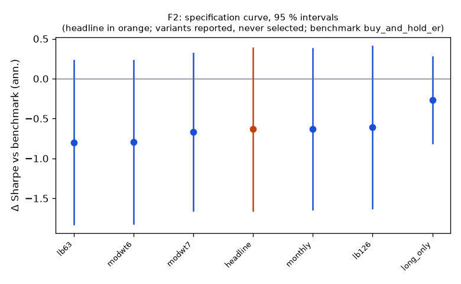

# Family F2

**Mechanism.** Slow information diffusion, under-reaction and herding create 1–12 month return continuation within asset classes; vol-scaling equalizes risk across assets (Moskowitz, Ooi & Pedersen 2012; Hurst, Ooi & Pedersen 2017).

- Registered: e19b44f22d84e998031544bf49c375b348964d1b (2026-10-10); run at 2026-10-10T04:27:29.489243+00:00, code 7316610aa337, git 5b07cbe1ae18
- Instruments: DBC, EEM, EFA, GLD, HYG, IEF, IWM, LQD, QQQ, SLV, SPY, TLT, USO, UUP, VNQ (basket, weights DBC 0.05, EEM 0.05, EFA 0.05, GLD 0.06, HYG 0.11, IEF 0.14, IWM 0.04, LQD 0.11, QQQ 0.04, SLV 0.03, SPY 0.05, TLT 0.06, USO 0.02, UUP 0.13, VNQ 0.04); window 2016-01-04 → 2025-10-01; benchmark buy_and_hold_er
- Trials: family 7 / budget 12; program 23 / 112 trials, 4 / 8 families

## Headline test

- Sharpe 0.23 vs benchmark 0.86 on 2195 days; difference -0.63 (95 % CI -1.65 … 0.38), Ledoit–Wolf p = 0.2079 (block 21 sessions)
- PSR(0) 0.749; DSR 0.170 (N = 23 program trials, V = 0.000316)
- Alpha 1.6 %/yr (NW t 0.70, p 0.4832), beta -0.02
- Floors: min_net_ret 0.013 vs 0.020 → FAIL; min_edge_to_cost 16.263 vs 3.000 → ok
- Coherence: 6 variants, share with the headline's sign 1.00, median variant modwt7 (floors no) → NOT coherent
- Before Holm across families: p 0.2079, floors no, coherent no, positive no

## Specification curve (reported; no variant is selected)



| variant | status | start | days | sharpe | Δ vs bench | CI | p | Δ on headline days | net ret | max dd | floors |
|---|---|---|---|---|---|---|---|---|---|---|---|
| headline | ok | 2017-01-06 | 2195 | 0.23 | -0.63 | -1.65 … 0.38 | 0.2079 | — | 1.3 % | -14.3 % | no |
| lb63 | ok | 2016-04-08 | 2384 | 0.11 | -0.80 | -1.83 … 0.23 | 0.1204 | -0.78 | 0.5 % | -18.4 % | no |
| lb126 | ok | 2016-07-08 | 2321 | 0.23 | -0.61 | -1.62 … 0.41 | 0.2329 | -0.59 | 1.4 % | -15.5 % | no |
| modwt6 | ok | 2016-04-08 | 2384 | 0.11 | -0.79 | -1.82 … 0.23 | 0.1214 | -0.79 | 0.5 % | -17.4 % | no |
| modwt7 | ok | 2016-07-08 | 2321 | 0.17 | -0.67 | -1.66 … 0.32 | 0.1754 | -0.65 | 0.9 % | -16.2 % | no |
| long_only | ok | 2017-01-06 | 2195 | 0.60 | -0.27 | -0.81 … 0.27 | 0.3203 | -0.27 | 4.7 % | -15.5 % | yes |
| monthly | ok | 2017-01-31 | 2179 | 0.24 | -0.63 | -1.64 … 0.37 | 0.2154 | -0.63 | 1.4 % | -15.2 % | no |

Coherence reads each variant's Δ on the days it shares with the headline (column 'Δ on headline days'); the curve and the p-values are each variant's own sample.

## Responses

| variant | crisis_return | exposure | max_dd | ret_ann | sharpe | skew | vol_ann |
|---|---|---|---|---|---|---|---|
| headline | 2020-02-19..2020-03-24: -3.0 %; 2022-01-03..2022-10-13: 10.9 % | 0.999 | -0.143 | 0.013 | 0.228 | -0.840 | 0.066 |
| lb63 | 2020-02-19..2020-03-24: 2.7 %; 2022-01-03..2022-10-13: 2.7 % | 0.999 | -0.184 | 0.005 | 0.106 | -0.470 | 0.071 |
| lb126 | 2020-02-19..2020-03-24: -3.7 %; 2022-01-03..2022-10-13: 15.1 % | 0.999 | -0.155 | 0.014 | 0.234 | -0.839 | 0.070 |
| modwt6 | 2020-02-19..2020-03-24: 2.7 %; 2022-01-03..2022-10-13: 5.7 % | 0.999 | -0.174 | 0.005 | 0.110 | -0.392 | 0.071 |
| modwt7 | 2020-02-19..2020-03-24: -4.4 %; 2022-01-03..2022-10-13: 13.5 % | 0.999 | -0.162 | 0.009 | 0.170 | -0.902 | 0.070 |
| long_only | 2020-02-19..2020-03-24: -11.1 %; 2022-01-03..2022-10-13: -5.4 % | 0.999 | -0.155 | 0.047 | 0.595 | -0.896 | 0.083 |
| monthly | 2020-02-19..2020-03-24: -4.7 %; 2022-01-03..2022-10-13: 12.9 % | 0.990 | -0.152 | 0.014 | 0.237 | -0.556 | 0.066 |

## State splits (headline; reported with 95 % Newey–West intervals, not tested)

**vix_tercile**

| group | n_days | mean_bp | ci_bp | sharpe |
|---|---|---|---|---|
| high | 732 | -1.08 | -5.16 … 3.00 | -0.30 |
| low | 730 | 1.65 | -0.26 … 3.56 | 0.96 |
| mid | 733 | 1.22 | -1.31 … 3.74 | 0.56 |

**macro_day**

| group | n_days | mean_bp | ci_bp | sharpe |
|---|---|---|---|---|
| macro | 270 | -0.03 | -5.91 … 5.86 | -0.01 |
| other | 1925 | 0.68 | -1.07 … 2.44 | 0.27 |

## Sample splits (headline; reported)

| split | n_days | sharpe | bench_sharpe | ret | max_dd | mean_bp |
|---|---|---|---|---|---|---|
| 2017_2019 | 751 | 0.27 | 1.45 | 3.4 % | -13.5 % | 0.49 |
| 2020_2025 | 1444 | 0.22 | 0.75 | 8.2 % | -14.3 % | 0.65 |
| equity_only | 2195 | 0.10 | 0.66 | 3.9 % | -36.8 % | 0.53 |

## Quasi-holdout slice (reported; never a gate)

*quasi-holdout 2025-10-01 → 2026-09-30: contaminated (the U11 holdout exposed these days' buy-and-hold outcomes before the families were chosen); a robustness slice, never a gate*

| slice | n_days | sharpe | bench_sharpe | ret | max_dd | mean_bp |
|---|---|---|---|---|---|---|
| 2025-10 → 2026-09 | 250 | 1.48 | 1.43 | 10.4 % | -3.8 % | 4.04 |

## Registered vs run spec

```
+registered: {sha: 'e19b44f22d84e998031544bf49c375b348964d1b', date: '2026-10-10'}
```
