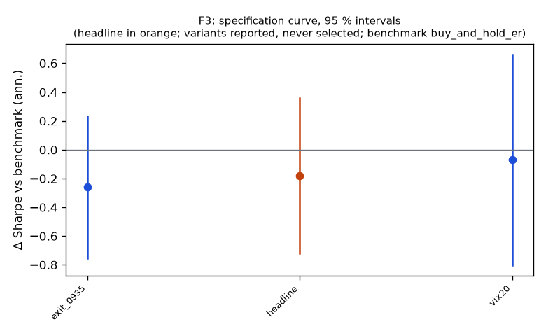

# Family F3

**Mechanism.** Almost all of the index return accrues from close to open while the intraday return is near zero or negative (Lou, Polk & Skouras 2019); overnight information arrival met by intraday liquidity provision, clientele differences and closing-auction pressure are the candidate drivers.

- Registered: e19b44f22d84e998031544bf49c375b348964d1b (2026-10-10); run at 2026-10-10T04:26:15.565077+00:00, code 7316610aa337, git 5b07cbe1ae18
- Instruments: QQQ, SPY (pooled, weights QQQ 0.45, SPY 0.55); window 2016-01-04 → 2025-10-01; benchmark buy_and_hold_er
- Trials: family 3 / budget 8; program 9 / 112 trials, 2 / 8 families

## Headline test

- Sharpe 0.72 vs benchmark 0.90 on 2449 days; difference -0.18 (95 % CI -0.72 … 0.36), Ledoit–Wolf p = 0.5027 (block 21 sessions)
- PSR(0) 0.984; DSR 0.951 (N = 9 program trials, V = 0.000049)
- Alpha 1.8 %/yr (NW t 0.56, p 0.5775), beta 0.40
- Floors: min_net_ret_vs_benchmark 0.086 vs 0.138 → FAIL; min_edge_to_cost 7.310 vs 3.000 → ok
- Coherence: 2 variants, share with the headline's sign 1.00, median variant exit_0935 (floors no) → NOT coherent
- Before Holm across families: p 0.5027, floors no, coherent no, positive no

## Specification curve (reported; no variant is selected)



| variant | status | start | days | sharpe | Δ vs bench | CI | p | Δ on headline days | net ret | max dd | floors |
|---|---|---|---|---|---|---|---|---|---|---|---|
| headline | ok | 2016-01-05 | 2449 | 0.72 | -0.18 | -0.72 … 0.36 | 0.5027 | — | 8.6 % | -29.6 % | no |
| vix20 | ok | 2016-04-05 | 2387 | 0.85 | -0.07 | -0.80 … 0.66 | 0.8441 | -0.07 | 5.4 % | -15.7 % | no |
| exit_0935 | ok | 2016-01-05 | 2449 | 0.64 | -0.26 | -0.75 … 0.23 | 0.2804 | -0.26 | 7.4 % | -29.2 % | no |

Coherence reads each variant's Δ on the days it shares with the headline (column 'Δ on headline days'); the curve and the p-values are each variant's own sample.

## Responses

| variant | exposure | hit_rate | max_dd | mean_per_trade_bp | sharpe | skew |
|---|---|---|---|---|---|---|
| headline | 1.000 | 0.566 | -0.296 | 3.623 | 0.725 | -1.800 |
| vix20 | 0.722 | 0.575 | -0.157 | 3.207 | 0.846 | -1.335 |
| exit_0935 | 1.000 | 0.553 | -0.292 | 3.213 | 0.644 | -1.894 |

## State splits (headline; reported with 95 % Newey–West intervals, not tested)

**vix_median**

| group | n_days | mean_bp | ci_bp | sharpe |
|---|---|---|---|---|
| above | 1225 | 2.86 | -2.57 … 8.28 | 0.44 |
| below | 1224 | 4.28 | 2.05 … 6.51 | 1.65 |

**vix_tercile**

| group | n_days | mean_bp | ci_bp | sharpe |
|---|---|---|---|---|
| high | 817 | 3.85 | -3.84 … 11.54 | 0.52 |
| low | 815 | 3.48 | 1.33 … 5.63 | 1.57 |
| mid | 817 | 3.38 | -0.43 … 7.18 | 0.95 |

**prior_day_sign**

| group | n_days | mean_bp | ci_bp | sharpe |
|---|---|---|---|---|
| down | 1078 | 6.51 | 2.02 … 11.00 | 1.21 |
| flat | 1 | -0.34 | — … — | — |
| up | 1370 | 1.25 | -3.05 … 5.56 | 0.28 |

**day_of_week**

| group | n_days | mean_bp | ci_bp | sharpe |
|---|---|---|---|---|
| Friday | 493 | 2.14 | -2.98 … 7.26 | 0.47 |
| Monday | 455 | -0.87 | -10.73 … 8.98 | -0.14 |
| Thursday | 495 | 0.72 | -7.26 … 8.70 | 0.15 |
| Tuesday | 505 | 9.85 | 2.29 … 17.42 | 2.15 |
| Wednesday | 501 | 5.48 | -0.98 … 11.95 | 1.23 |

**macro_day**

| group | n_days | mean_bp | ci_bp | sharpe |
|---|---|---|---|---|
| macro | 301 | 8.14 | -0.46 … 16.74 | 1.61 |
| other | 2148 | 2.93 | -0.10 … 5.95 | 0.60 |

## Sample splits (headline; reported)

| split | n_days | sharpe | bench_sharpe | ret | max_dd | mean_bp |
|---|---|---|---|---|---|---|
| 2016_2019 | 1005 | 1.16 | 1.14 | 44.9 % | -9.7 % | 3.83 |
| 2020_2025 | 1444 | 0.58 | 0.83 | 53.2 % | -29.6 % | 3.38 |
| iwm_dia | 2449 | 0.72 | 0.68 | 121.6 % | -30.7 % | 3.57 |

## Quasi-holdout slice (reported; never a gate)

*quasi-holdout 2025-10-01 → 2026-09-30: contaminated (the U11 holdout exposed these days' buy-and-hold outcomes before the families were chosen); a robustness slice, never a gate*

| slice | n_days | sharpe | bench_sharpe | ret | max_dd | mean_bp |
|---|---|---|---|---|---|---|
| 2025-10 → 2026-09 | 250 | 1.80 | 1.18 | 19.9 % | -7.8 % | 7.49 |

## Per-instrument headline Sharpe (raw and James–Stein shrunk toward the family mean)

| instrument | sharpe | sharpe_js |
|---|---|---|
| QQQ | 0.76 | 0.76 |
| SPY | 0.67 | 0.67 |

## Registered vs run spec

```
+registered: {sha: 'e19b44f22d84e998031544bf49c375b348964d1b', date: '2026-10-10'}
```
