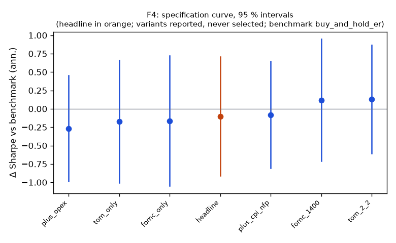

# Family F4

**Mechanism.** Scheduled flows and scheduled information concentrate returns on known days: the pre-FOMC announcement drift (Lucca & Moench 2015), turn-of-month pension and payroll flows (Etula, Rinne, Suominen & Vaittinen 2020) and month-end duration extension in Treasuries.

- Registered: e19b44f22d84e998031544bf49c375b348964d1b (2026-10-10); run at 2026-10-10T04:26:49.664109+00:00, code 7316610aa337, git 5b07cbe1ae18
- Instruments: SPY, TLT (pooled, weights SPY 0.45, TLT 0.55); window 2016-01-04 → 2025-10-01; benchmark buy_and_hold_er
- Trials: family 7 / budget 10; program 16 / 112 trials, 3 / 8 families

## Headline test

- Sharpe 0.57 vs benchmark 0.67 on 2392 days; difference -0.10 (95 % CI -0.91 … 0.71), Ledoit–Wolf p = 0.8121 (block 21 sessions)
- PSR(0) 0.958; DSR 0.785 (N = 16 program trials, V = 0.000117)
- Alpha 1.4 %/yr (NW t 1.14, p 0.2560), beta 0.13
- Floors: min_net_ret 0.022 vs 0.020 → ok; min_edge_to_cost 22.977 vs 3.000 → ok
- Coherence: 6 variants, share with the headline's sign 0.67, median variant fomc_only (floors no) → NOT coherent
- Before Holm across families: p 0.8121, floors yes, coherent no, positive no

## Specification curve (reported; no variant is selected)



| variant | status | start | days | sharpe | Δ vs bench | CI | p | Δ on headline days | net ret | max dd | floors |
|---|---|---|---|---|---|---|---|---|---|---|---|
| headline | ok | 2016-03-29 | 2392 | 0.57 | -0.10 | -0.91 … 0.71 | 0.8121 | — | 2.2 % | -5.5 % | yes |
| fomc_only | ok | 2016-03-29 | 2392 | 0.51 | -0.16 | -1.05 … 0.72 | 0.7031 | -0.16 | 1.1 % | -4.2 % | no |
| tom_only | ok | 2016-03-29 | 2392 | 0.50 | -0.17 | -1.00 … 0.66 | 0.6732 | -0.17 | 1.9 % | -5.3 % | no |
| tom_2_2 | ok | 2016-03-28 | 2393 | 0.80 | 0.13 | -0.61 … 0.87 | 0.7156 | 0.13 | 3.1 % | -6.5 % | yes |
| plus_opex | ok | 2016-03-16 | 2400 | 0.41 | -0.27 | -0.99 … 0.46 | 0.4743 | -0.26 | 2.1 % | -12.8 % | yes |
| plus_cpi_nfp | ok | 2016-03-29 | 2392 | 0.59 | -0.08 | -0.81 … 0.65 | 0.8181 | -0.08 | 2.7 % | -8.9 % | yes |
| fomc_1400 | ok | 2016-01-26 | 2435 | 0.84 | 0.12 | -0.71 … 0.95 | 0.7791 | 0.14 | 1.5 % | -1.7 % | no |

Coherence reads each variant's Δ on the days it shares with the headline (column 'Δ on headline days'); the curve and the p-values are each variant's own sample.

## Responses

| variant | exposure | hit_rate | max_dd | mean_per_trade_bp | ret_ann | sharpe |
|---|---|---|---|---|---|---|
| headline | 0.285 | 0.542 | -0.055 | 7.185 | 0.022 | 0.568 |
| fomc_only | 0.151 | 0.547 | -0.042 | 10.419 | 0.011 | 0.506 |
| tom_only | 0.239 | 0.594 | -0.053 | 16.086 | 0.019 | 0.498 |
| tom_2_2 | 0.281 | 0.554 | -0.065 | 9.928 | 0.031 | 0.801 |
| plus_opex | 0.550 | 0.537 | -0.128 | 3.806 | 0.021 | 0.412 |
| plus_cpi_nfp | 0.421 | 0.548 | -0.089 | 6.856 | 0.027 | 0.589 |
| fomc_1400 | 0.152 | 0.582 | -0.017 | 15.294 | 0.015 | 0.836 |

## State splits (headline; reported with 95 % Newey–West intervals, not tested)

**vix_tercile**

| group | n_days | mean_bp | ci_bp | sharpe |
|---|---|---|---|---|
| high | 798 | 1.87 | -0.33 … 4.06 | 0.84 |
| low | 796 | 0.74 | -0.26 … 1.74 | 0.83 |
| mid | 798 | 0.12 | -1.46 … 1.70 | 0.09 |

**macro_day**

| group | n_days | mean_bp | ci_bp | sharpe |
|---|---|---|---|---|
| macro | 294 | 1.88 | -1.55 … 5.31 | 0.92 |
| other | 2098 | 0.77 | -0.23 … 1.77 | 0.51 |

## Sample splits (headline; reported)

| split | n_days | sharpe | bench_sharpe | ret | max_dd | mean_bp |
|---|---|---|---|---|---|---|
| 2016_2019 | 948 | 0.60 | 1.34 | 6.6 % | -3.6 % | 0.69 |
| 2020_2025 | 1444 | 0.57 | 0.46 | 15.7 % | -5.5 % | 1.05 |
| qqq_iwm | 2392 | 0.36 | 0.79 | 33.0 % | -15.8 % | 1.38 |

## Quasi-holdout slice (reported; never a gate)

*quasi-holdout 2025-10-01 → 2026-09-30: contaminated (the U11 holdout exposed these days' buy-and-hold outcomes before the families were chosen); a robustness slice, never a gate*

| slice | n_days | sharpe | bench_sharpe | ret | max_dd | mean_bp |
|---|---|---|---|---|---|---|
| 2025-10 → 2026-09 | 250 | 0.18 | 0.21 | 0.4 % | -1.6 % | 0.19 |

## Per-instrument headline Sharpe (raw and James–Stein shrunk toward the family mean)

| instrument | sharpe | sharpe_js |
|---|---|---|
| SPY | 0.42 | 0.42 |
| TLT | 0.48 | 0.48 |

## Registered vs run spec

```
+registered: {sha: 'e19b44f22d84e998031544bf49c375b348964d1b', date: '2026-10-10'}
```
