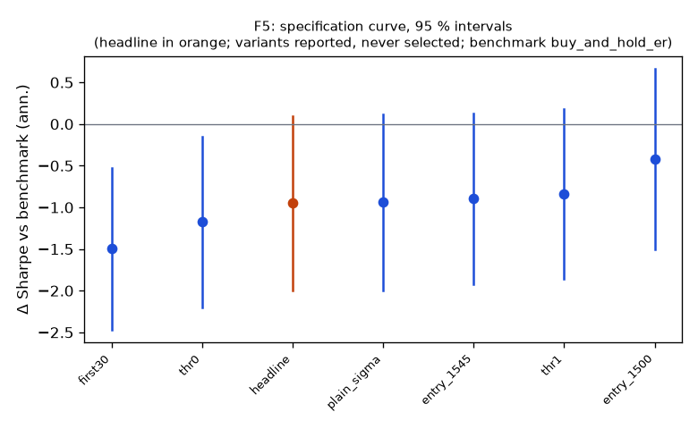

# Family F5

**Mechanism.** Gamma hedging by option market makers and leveraged-ETF rebalancing buy into rises and sell into falls near the close (Baltussen, Da, Lammers & Martens 2021; Cheng & Madhavan 2009), and late-informed traders act on the morning's information (Gao, Han, Li & Zhou 2018), so the last half hour continues the direction of the day.

- Registered: dd8228d0abeafdf6f2f45ed621fd5ab81279fa1b (2026-10-10); run at 2026-10-10T05:38:27.360004+00:00, code 8a41bf5951b1, git f984d6460b63
- Instruments: DIA, IWM, QQQ, SPY (pooled, weights DIA 0.28, IWM 0.22, QQQ 0.22, SPY 0.28); window 2016-01-04 → 2025-10-01; benchmark buy_and_hold_er
- Trials: family 7 / budget 12; program 30 / 112 trials, 5 / 8 families

## Headline test

- Sharpe -0.12 vs benchmark 0.83 on 2386 days; difference -0.95 (95 % CI -2.00 … 0.10), Ledoit–Wolf p = 0.0710 (block 21 sessions)
- PSR(0) 0.354; DSR 0.001 (N = 30 program trials, V = 0.000704)
- Alpha -0.3 %/yr (NW t -0.27, p 0.7847), beta -0.00
- Floors: min_net_ret -0.004 vs 0.020 → FAIL; min_edge_to_cost 0.809 vs 3.000 → FAIL
- Coherence: 6 variants, share with the headline's sign 1.00, median variant plain_sigma (floors no) → NOT coherent
- Before Holm across families: p 0.0710, floors no, coherent no, positive no

## Specification curve (reported; no variant is selected)



| variant | status | start | days | sharpe | Δ vs bench | CI | p | Δ on headline days | net ret | max dd | floors |
|---|---|---|---|---|---|---|---|---|---|---|---|
| headline | ok | 2016-04-06 | 2386 | -0.12 | -0.95 | -2.00 … 0.10 | 0.0710 | — | -0.4 % | -9.5 % | no |
| first30 | ok | 2016-04-18 | 2378 | -0.68 | -1.50 | -2.47 … -0.53 | 0.0035 | -1.50 | -0.7 % | -7.3 % | no |
| entry_1500 | ok | 2016-04-06 | 2386 | 0.41 | -0.42 | -1.50 … 0.66 | 0.4203 | -0.42 | 1.3 % | -5.7 % | no |
| entry_1545 | ok | 2016-04-06 | 2386 | -0.07 | -0.90 | -1.92 … 0.12 | 0.0890 | -0.90 | -0.2 % | -9.2 % | no |
| thr0 | ok | 2016-04-05 | 2387 | -0.36 | -1.18 | -2.20 … -0.15 | 0.0250 | -1.18 | -1.1 % | -13.9 % | no |
| thr1 | ok | 2016-04-06 | 2386 | -0.01 | -0.84 | -1.86 … 0.18 | 0.0940 | -0.84 | -0.0 % | -5.6 % | no |
| plain_sigma | ok | 2016-01-06 | 2448 | -0.12 | -0.94 | -1.99 … 0.12 | 0.0790 | -0.94 | -0.4 % | -10.3 % | no |

Coherence reads each variant's Δ on the days it shares with the headline (column 'Δ on headline days'); the curve and the p-values are each variant's own sample.

## Responses

| variant | exposure | hit_rate | max_dd | mean_per_trade_bp | sharpe | skew |
|---|---|---|---|---|---|---|
| headline | 0.789 | 0.465 | -0.095 | -0.474 | -0.122 | 1.379 |
| first30 | 0.385 | 0.442 | -0.073 | -2.197 | -0.678 | 1.523 |
| entry_1500 | 0.781 | 0.491 | -0.057 | 1.215 | 0.406 | 1.461 |
| entry_1545 | 0.790 | 0.465 | -0.092 | -0.220 | -0.070 | 0.889 |
| thr0 | 1.000 | 0.463 | -0.139 | -1.379 | -0.355 | 0.360 |
| thr1 | 0.388 | 0.456 | -0.056 | -0.034 | -0.014 | 2.849 |
| plain_sigma | 0.865 | 0.468 | -0.103 | -0.457 | -0.125 | 0.915 |

## State splits (headline; reported with 95 % Newey–West intervals, not tested)

**vix_tercile**

| group | n_days | mean_bp | ci_bp | sharpe |
|---|---|---|---|---|
| high | 798 | 0.95 | -0.62 … 2.53 | 0.66 |
| low | 795 | -0.59 | -1.21 … 0.03 | -1.05 |
| mid | 793 | -0.75 | -1.75 … 0.24 | -0.82 |

**macro_day**

| group | n_days | mean_bp | ci_bp | sharpe |
|---|---|---|---|---|
| macro | 293 | -0.57 | -2.64 … 1.50 | -0.46 |
| other | 2093 | -0.07 | -0.78 … 0.65 | -0.06 |

**abs_move_tercile**

| group | n_days | mean_bp | ci_bp | sharpe |
|---|---|---|---|---|
| large | 796 | 2.23 | 0.39 … 4.07 | 1.39 |
| mid | 795 | -0.84 | -1.45 … -0.23 | -1.41 |
| small | 795 | -1.77 | -2.42 … -1.12 | -3.24 |

**day_of_week**

| group | n_days | mean_bp | ci_bp | sharpe |
|---|---|---|---|---|
| Friday | 481 | -1.06 | -2.28 … 0.16 | -1.05 |
| Monday | 444 | -0.34 | -1.85 … 1.16 | -0.33 |
| Thursday | 482 | 0.36 | -1.22 … 1.95 | 0.35 |
| Tuesday | 491 | -0.55 | -1.74 … 0.64 | -0.68 |
| Wednesday | 488 | 0.93 | -1.06 … 2.93 | 0.75 |

## Sample splits (headline; reported)

| split | n_days | sharpe | bench_sharpe | ret | max_dd | mean_bp |
|---|---|---|---|---|---|---|
| 2016_2019 | 942 | 0.30 | 1.21 | 2.5 % | -3.6 % | 0.27 |
| 2020_2025 | 1444 | -0.35 | 0.71 | -5.7 % | -9.5 % | -0.39 |
| sector_etfs | 2386 | -1.04 | 0.79 | -21.9 % | -22.0 % | -1.02 |

## Quasi-holdout slice (reported; never a gate)

*quasi-holdout 2025-10-01 → 2026-09-30: contaminated (the U11 holdout exposed these days' buy-and-hold outcomes before the families were chosen); a robustness slice, never a gate*

| slice | n_days | sharpe | bench_sharpe | ret | max_dd | mean_bp |
|---|---|---|---|---|---|---|
| 2025-10 → 2026-09 | 250 | -2.47 | 1.12 | -4.5 % | -4.8 % | -1.86 |

## Per-instrument headline Sharpe (raw and James–Stein shrunk toward the family mean)

| instrument | sharpe | sharpe_js |
|---|---|---|
| DIA | -0.04 | -0.08 |
| IWM | -0.46 | -0.25 |
| QQQ | 0.02 | -0.06 |
| SPY | 0.06 | -0.04 |

## Registered vs run spec

```
+registered: {sha: 'dd8228d0abeafdf6f2f45ed621fd5ab81279fa1b', date: '2026-10-10'}
```
