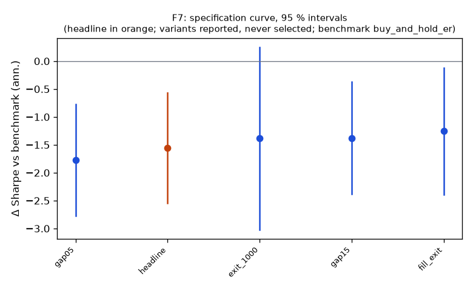

# Family F7

**Mechanism.** Large overnight gaps mix information, which persists, with liquidity-driven overnight moves and opening-auction imbalances, which revert; on days without scheduled news the liquidity component dominates, so part of the gap reverts within the first hour.

- Registered: dd8228d0abeafdf6f2f45ed621fd5ab81279fa1b (2026-10-10); run at 2026-10-10T05:38:53.685288+00:00, code 8a41bf5951b1, git f984d6460b63
- Instruments: IWM, QQQ, SPY (pooled, weights IWM 0.30, QQQ 0.31, SPY 0.39); window 2016-01-04 → 2025-10-01; benchmark buy_and_hold_er
- Trials: family 5 / budget 10; program 35 / 112 trials, 6 / 8 families

## Headline test

- Sharpe -0.69 vs benchmark 0.87 on 2426 days; difference -1.55 (95 % CI -2.55 … -0.56), Ledoit–Wolf p = 0.0055 (block 21 sessions)
- PSR(0) 0.017; DSR 0.000 (N = 35 program trials, V = 0.001137)
- Alpha -1.9 %/yr (NW t -2.18, p 0.0289), beta 0.00
- Floors: min_net_ret -0.018 vs 0.020 → FAIL; min_edge_to_cost -0.864 vs 3.000 → FAIL
- Coherence: 4 variants, share with the headline's sign 1.00, median variant exit_1000 (floors no) → NOT coherent
- Before Holm across families: p 0.0055, floors no, coherent no, positive no

## Specification curve (reported; no variant is selected)



| variant | status | start | days | sharpe | Δ vs bench | CI | p | Δ on headline days | net ret | max dd | floors |
|---|---|---|---|---|---|---|---|---|---|---|---|
| headline | ok | 2016-02-08 | 2426 | -0.69 | -1.55 | -2.55 … -0.56 | 0.0055 | — | -1.8 % | -18.3 % | no |
| gap05 | ok | 2016-02-03 | 2429 | -0.92 | -1.77 | -2.78 … -0.77 | 0.0030 | -1.80 | -2.7 % | -25.5 % | no |
| gap15 | ok | 2016-02-08 | 2426 | -0.51 | -1.38 | -2.38 … -0.37 | 0.0110 | -1.38 | -1.1 % | -13.9 % | no |
| exit_1000 | ok | 2016-02-08 | 2426 | -0.52 | -1.39 | -3.02 … 0.25 | 0.0810 | -1.38 | -1.1 % | -11.5 % | no |
| fill_exit | ok | 2016-02-08 | 2426 | -0.39 | -1.25 | -2.39 … -0.12 | 0.0380 | -1.25 | -1.3 % | -16.9 % | no |

Coherence reads each variant's Δ on the days it shares with the headline (column 'Δ on headline days'); the curve and the p-values are each variant's own sample.

## Responses

| variant | exposure | hit_rate | max_dd | mean_per_trade_bp | sharpe | skew |
|---|---|---|---|---|---|---|
| headline | 0.292 | 0.462 | -0.183 | -4.262 | -0.689 | 0.173 |
| gap05 | 0.598 | 0.472 | -0.255 | -3.798 | -0.920 | 0.165 |
| gap15 | 0.130 | 0.427 | -0.139 | -5.715 | -0.511 | 0.661 |
| exit_1000 | 0.292 | 0.446 | -0.115 | -3.196 | -0.519 | 2.995 |
| fill_exit | 0.292 | 0.467 | -0.169 | -3.042 | -0.386 | 10.882 |

## State splits (headline; reported with 95 % Newey–West intervals, not tested)

**vix_tercile**

| group | n_days | mean_bp | ci_bp | sharpe |
|---|---|---|---|---|
| high | 809 | -1.13 | -2.81 … 0.55 | -0.72 |
| low | 808 | -0.44 | -0.99 … 0.10 | -0.92 |
| mid | 809 | -0.56 | -1.33 … 0.20 | -0.77 |

**day_of_week**

| group | n_days | mean_bp | ci_bp | sharpe |
|---|---|---|---|---|
| Friday | 488 | -0.82 | -1.87 … 0.23 | -0.99 |
| Monday | 452 | -0.92 | -2.86 … 1.03 | -0.69 |
| Thursday | 490 | -0.79 | -2.18 … 0.59 | -0.71 |
| Tuesday | 500 | -0.79 | -2.03 … 0.44 | -0.79 |
| Wednesday | 496 | -0.25 | -1.46 … 0.95 | -0.30 |

**abs_move_tercile**

| group | n_days | mean_bp | ci_bp | sharpe |
|---|---|---|---|---|
| large | 809 | -3.79 | -5.54 … -2.05 | -2.60 |
| mid | 808 | 0.11 | -0.58 … 0.79 | 0.17 |
| small | 809 | 1.55 | 0.70 … 2.41 | 1.98 |

**prior_day_sign**

| group | n_days | mean_bp | ci_bp | sharpe |
|---|---|---|---|---|
| down | 1095 | -0.32 | -1.43 … 0.79 | -0.27 |
| up | 1331 | -1.03 | -1.84 … -0.23 | -1.14 |

## Sample splits (headline; reported)

| split | n_days | sharpe | bench_sharpe | ret | max_dd | mean_bp |
|---|---|---|---|---|---|---|
| 2016_2019 | 982 | -0.91 | 1.29 | -6.9 % | -7.2 % | -0.72 |
| 2020_2025 | 1444 | -0.61 | 0.72 | -9.9 % | -13.9 % | -0.71 |
| stocks | 2426 | -1.16 | 1.24 | -24.4 % | -26.4 % | -1.14 |

## Quasi-holdout slice (reported; never a gate)

*quasi-holdout 2025-10-01 → 2026-09-30: contaminated (the U11 holdout exposed these days' buy-and-hold outcomes before the families were chosen); a robustness slice, never a gate*

| slice | n_days | sharpe | bench_sharpe | ret | max_dd | mean_bp |
|---|---|---|---|---|---|---|
| 2025-10 → 2026-09 | 250 | 1.14 | 1.14 | 3.3 % | -2.7 % | 1.33 |

## Per-instrument headline Sharpe (raw and James–Stein shrunk toward the family mean)

| instrument | sharpe | sharpe_js |
|---|---|---|
| IWM | -0.32 | -0.32 |
| QQQ | -0.33 | -0.33 |
| SPY | -1.22 | -1.22 |

## Registered vs run spec

```
+registered: {sha: 'dd8228d0abeafdf6f2f45ed621fd5ab81279fa1b', date: '2026-10-10'}
```
