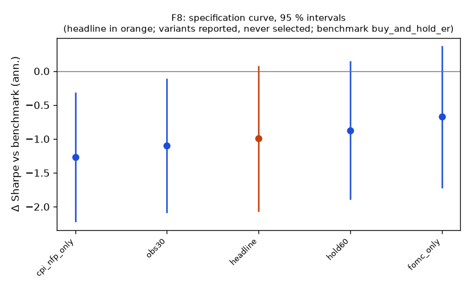

# Family F8

**Mechanism.** After scheduled macro releases (FOMC statements at 14:00; CPI and NFP at 08:30) prices under-react for one to two hours as information is absorbed across asset classes and dealers' inventory constraints slow the adjustment, so the first 15-minute reaction predicts the next 90 minutes.

- Registered: dd8228d0abeafdf6f2f45ed621fd5ab81279fa1b (2026-10-10); run at 2026-10-10T05:39:15.009665+00:00, code 8a41bf5951b1, git f984d6460b63
- Instruments: SPY, TLT (pooled, weights SPY 0.45, TLT 0.55); window 2016-01-04 → 2025-10-01; benchmark buy_and_hold_er
- Trials: family 5 / budget 8; program 40 / 112 trials, 7 / 8 families

## Headline test

- Sharpe -0.29 vs benchmark 0.71 on 2446 days; difference -0.99 (95 % CI -2.06 … 0.07), Ledoit–Wolf p = 0.0715 (block 21 sessions)
- PSR(0) 0.191; DSR 0.000 (N = 40 program trials, V = 0.001142)
- Alpha -0.3 %/yr (NW t -0.81, p 0.4179), beta -0.00
- Floors: min_net_ret -0.003 vs 0.020 → FAIL; min_edge_to_cost -0.178 vs 3.000 → FAIL
- Coherence: 4 variants, share with the headline's sign 1.00, median variant obs30 (floors no) → NOT coherent
- Before Holm across families: p 0.0715, floors no, coherent no, positive no

## Specification curve (reported; no variant is selected)



| variant | status | start | days | sharpe | Δ vs bench | CI | p | Δ on headline days | net ret | max dd | floors |
|---|---|---|---|---|---|---|---|---|---|---|---|
| headline | ok | 2016-01-08 | 2446 | -0.29 | -0.99 | -2.06 … 0.07 | 0.0715 | — | -0.3 % | -4.4 % | no |
| obs30 | ok | 2016-01-08 | 2446 | -0.39 | -1.10 | -2.08 … -0.12 | 0.0370 | -1.10 | -0.4 % | -6.0 % | no |
| hold60 | ok | 2016-01-08 | 2446 | -0.17 | -0.88 | -1.89 … 0.14 | 0.0815 | -0.88 | -0.1 % | -3.6 % | no |
| fomc_only | ok | 2016-01-27 | 2434 | 0.03 | -0.67 | -1.71 … 0.36 | 0.1879 | -0.67 | 0.0 % | -2.5 % | no |
| cpi_nfp_only | ok | 2016-01-08 | 2446 | -0.56 | -1.27 | -2.21 … -0.32 | 0.0080 | -1.27 | -0.3 % | -3.6 % | no |

Coherence reads each variant's Δ on the days it shares with the headline (column 'Δ on headline days'); the curve and the p-values are each variant's own sample.

## Responses

| variant | exposure | hit_rate | max_dd | mean_per_trade_bp | sharpe | skew |
|---|---|---|---|---|---|---|
| headline | 0.122 | 0.482 | -0.044 | -3.642 | -0.286 | 1.384 |
| obs30 | 0.123 | 0.480 | -0.060 | -2.797 | -0.392 | -0.662 |
| hold60 | 0.122 | 0.484 | -0.036 | -0.929 | -0.170 | -2.929 |
| fomc_only | 0.032 | 0.493 | -0.025 | -2.893 | 0.028 | 3.696 |
| cpi_nfp_only | 0.093 | 0.478 | -0.036 | -3.913 | -0.561 | -4.763 |

## State splits (headline; reported with 95 % Newey–West intervals, not tested)

**vix_tercile**

| group | n_days | mean_bp | ci_bp | sharpe |
|---|---|---|---|---|
| high | 818 | -0.36 | -0.93 … 0.21 | -0.73 |
| low | 815 | -0.01 | -0.23 … 0.21 | -0.05 |
| mid | 813 | 0.04 | -0.40 … 0.47 | 0.09 |

**abs_move_tercile**

| group | n_days | mean_bp | ci_bp | sharpe |
|---|---|---|---|---|
| large | 816 | -0.14 | -0.74 … 0.47 | -0.25 |
| mid | 815 | -0.12 | -0.39 … 0.16 | -0.44 |
| small | 815 | -0.08 | -0.41 … 0.24 | -0.27 |

**day_of_week**

| group | n_days | mean_bp | ci_bp | sharpe |
|---|---|---|---|---|
| Friday | 493 | -0.49 | -0.88 … -0.10 | -1.64 |
| Monday | 455 | 0.00 | 0.00 … 0.00 | — |
| Thursday | 494 | -0.19 | -0.51 … 0.13 | -0.81 |
| Tuesday | 504 | 0.10 | -0.20 … 0.41 | 0.47 |
| Wednesday | 500 | 0.01 | -1.01 … 1.03 | 0.02 |

## Sample splits (headline; reported)

| split | n_days | sharpe | bench_sharpe | ret | max_dd | mean_bp |
|---|---|---|---|---|---|---|
| 2016_2019 | 1002 | -0.06 | 1.45 | -0.2 % | -1.7 % | -0.02 |
| 2020_2025 | 1444 | -0.39 | 0.46 | -2.6 % | -4.1 % | -0.18 |
| qqq_iwm_gld | 2446 | -0.03 | 1.11 | -0.6 % | -6.3 % | -0.02 |

## Quasi-holdout slice (reported; never a gate)

*quasi-holdout 2025-10-01 → 2026-09-30: contaminated (the U11 holdout exposed these days' buy-and-hold outcomes before the families were chosen); a robustness slice, never a gate*

| slice | n_days | sharpe | bench_sharpe | ret | max_dd | mean_bp |
|---|---|---|---|---|---|---|
| 2025-10 → 2026-09 | 250 | 0.50 | 0.21 | 0.3 % | -0.5 % | 0.12 |

## Per-instrument headline Sharpe (raw and James–Stein shrunk toward the family mean)

| instrument | sharpe | sharpe_js |
|---|---|---|
| SPY | -0.11 | -0.11 |
| TLT | -0.43 | -0.43 |

## Registered vs run spec

```
+registered: {sha: 'dd8228d0abeafdf6f2f45ed621fd5ab81279fa1b', date: '2026-10-10'}
```
