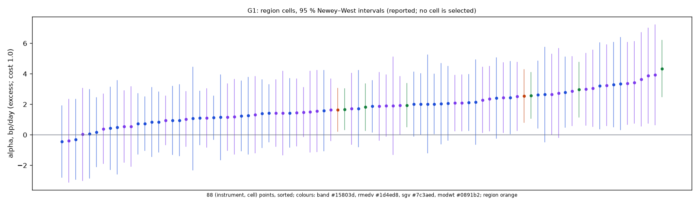
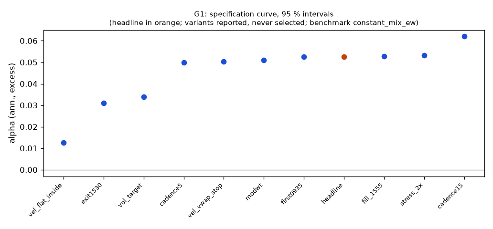

# Family G1

**Mechanism.** Within a session, a move that exceeds the typical move from the open for that time of day reveals a persistent order imbalance (institutional parent orders worked through the day, leveraged-ETF and option-hedging flows that buy into rises and sell into falls), which continues at the 30–90-minute horizon while the 5–10-minute horizon reverts; a smoothed velocity or a band breakout decided every 30 minutes and held until it reverses earns that continuation, long volatility and flat overnight (Zarattini, Aziz & Barbon 2024; Meyers 2025, 2026).

- Registered: c1689612eef33fd87f87ec99bc793cd3038bbc7b (2026-10-11); run at 2026-10-11T04:01:53.030381+00:00, code 2994b5e83c6e, git da97726c77b7
- Instruments: QQQ, SPY (pooled, weights QQQ 0.50, SPY 0.50, from the equal 0 sessions); window 2016-01-04 → 2025-10-01; benchmark constant_mix_ew
- N_eff 1.06 of 2 instruments (the pooled stream's effective count)
- Test: overlay_alpha, one-sided, at cost 1.0; excess returns: FRED DTB3 as of each session's open, ACT/360
- MDE line: 3.17 bp/day at 80% power over 2400 days, vol 8.0%, 4 families; expected 3.00 bp/day → a DIAGNOSTIC (below its MDE)
- MDE at the realized excess volatility 6.6% over 2436 days: 2.58 bp/day (Sharpe 0.99; reported, the registered line is the one above)
- Trials: family 11 / budget 12; program 11 / 42 trials, 1 / 5 families

## Headline test

- Alpha 5.3 %/yr (2.09 bp/day) on 2436 days, excess of the T-bill; bootstrap t 2.59, Newey–West t 2.70; one-sided p = 0.0034 (block 21 sessions); interval 2.0 % … —; Sharpe 0.80 (benchmark 0.83)
- Looks: K = 60 configurations examined on the development window (families/looks.jsonl); Bonferroni bound p × K = 0.2040
- PSR(0) 0.995; DSR 0.476 (N = 55 program trials, V = 0.000987) — a ledger diagnostic, not part of the verdict
- Alpha 5.3 %/yr (NW t 2.74, p 0.0061), beta -0.00
- Floors: min_net_ret 0.052 vs 0.030 → ok; min_edge_to_cost 2.990 vs 2.000 → ok
- Coherence (cells, the verdict's): 86 (instrument, cell) points, share with the headline's sign 0.965 (needs 0.667), median cell 1.77 bp/day → coherent
- Coherence (variants, reported): 10 variants, share with the headline's sign 1.00, median variant vel_vwap_stop (floors yes) → coherent
- Before Holm across families: p 0.0034, floors yes, coherent yes, positive yes (at cost 1.0)

## Cost curve (every variant re-priced from its cost ledger; the verdict reads one column)

| variant | registered | 0.3 | 1.0 | 2.3 |
|---|---|---|---|---|
| headline | 0.024 (p 0.108); SR 0.70, ret 4.5 %, floors no | 0.070 (p 0.000); SR 1.40, ret 9.4 %, floors yes | 0.053 (p 0.003); SR 1.13, ret 7.5 %, floors yes | 0.020 (p 0.152); SR 0.64, ret 4.1 %, floors no |
| cadence15 | SR 0.64, ret 4.2 %, floors no | SR 1.58, ret 11.0 %, floors yes | SR 1.24, ret 8.5 %, floors yes | SR 0.60, ret 3.9 %, floors no |
| cadence5 | SR 0.32, ret 2.0 %, floors no | SR 1.41, ret 10.1 %, floors yes | SR 1.02, ret 7.2 %, floors yes | SR 0.30, ret 1.9 %, floors no |
| first0935 | SR 0.70, ret 4.5 %, floors no | SR 1.40, ret 9.4 %, floors yes | SR 1.13, ret 7.5 %, floors yes | SR 0.64, ret 4.1 %, floors no |
| exit1530 | SR 0.28, ret 1.5 %, floors no | SR 1.20, ret 7.0 %, floors yes | SR 0.91, ret 5.2 %, floors no | SR 0.39, ret 2.1 %, floors no |
| vel_vwap_stop | SR 0.60, ret 4.1 %, floors no | SR 1.28, ret 9.2 %, floors yes | SR 1.02, ret 7.2 %, floors yes | SR 0.54, ret 3.6 %, floors no |
| vel_flat_inside | SR -0.07, ret -0.4 %, floors no | SR 1.24, ret 5.3 %, floors yes | SR 0.81, ret 3.4 %, floors no | SR 0.00, ret -0.1 %, floors no |
| modwt | SR 0.68, ret 4.3 %, floors no | SR 1.37, ret 9.2 %, floors yes | SR 1.11, ret 7.3 %, floors yes | SR 0.62, ret 3.9 %, floors no |
| vol_target | SR 0.62, ret 2.8 %, floors no | SR 1.55, ret 7.4 %, floors yes | SR 1.20, ret 5.6 %, floors yes | SR 0.54, ret 2.5 %, floors no |
| fill_1555 | SR 0.71, ret 4.5 %, floors no | SR 1.41, ret 9.4 %, floors yes | SR 1.14, ret 7.5 %, floors yes | SR 0.65, ret 4.1 %, floors no |
| stress_2x | SR 0.70, ret 4.4 %, floors no | SR 1.41, ret 9.5 %, floors yes | SR 1.15, ret 7.6 %, floors yes | SR 0.65, ret 4.1 %, floors no |

Columns: `registered` = the simulated costs (quotes half-spread + slippage per side); a number = that round-trip cost in bp on every fill; `measured` = the forward test's fill reconciliation. The headline column shows its statistic and p first.

## Account check (risk/account.py; nothing here changes a P&L)

- margin_30k (margin account, equity 30,000): tradable
- Day trades: 10549 in total, at most 44 in 5 sessions; PDT rule applies: no; first flag None
- Gross exposure: 1.00× intraday (limit 4×), 0.00× overnight (limit 2×); first breach None
- What the PDT rule would cost on an account under the floor: 0.0 % of the day trades blocked (0)

## Data notes

- Headline members: 92 session(s) priced with the first as-of cost table (2016Q1), 0 bar(s) in stress sessions, 0 session(s) without a cash-yield rate

## Region cells (the specification curve over every cell; reported, the region is the headline)

- Parity of the re-simulation (wfo.position_backtest) with the headline members at the booked costs: QQQ max |Δ daily return| 0 over 2432 days; SPY max |Δ daily return| 0 over 2436 days

Region re-simulated at each cost: alpha bp/day (excess Sharpe). The headline test re-prices the members' cost ledgers instead (first order); the two agree to the re-pricing error.

| region | registered | 0.3 | 1.0 | 2.3 |
|---|---|---|---|---|
| QQQ | 1.35 bp (0.45) | 3.24 bp (1.09) | 2.54 bp (0.85) | 1.24 bp (0.41) |
| SPY | 0.58 bp (0.24) | 2.30 bp (0.97) | 1.64 bp (0.69) | 0.37 bp (0.15) |
| pooled | 0.96 bp (0.37) | 2.77 bp (1.06) | 2.09 bp (0.80) | 0.80 bp (0.31) |

- 86 (instrument, cell) points at cost 1.0: share with the headline's sign 0.965, median cell 1.77 bp/day; positive 83 / 86
- By estimator: band 6/6 positive, median 2.26 bp; rmedv 38/40 positive, median 1.42 bp; sgv 39/40 positive, median 1.89 bp



Every cell at cost 1.0, alpha bp/day (excess), sorted by the pooled cell:

| cell | QQQ | SPY | pooled | CI (pooled) | Sharpe (pooled) |
|---|---|---|---|---|---|
| sgv_n12_t1 | 3.89 | 3.24 | 3.56 | 0.86 … 6.26 | 0.88 |
| sgv_n12_t0.75 | 3.93 | 3.06 | 3.49 | 0.81 … 6.18 | 0.83 |
| sgv_n12_t1.5 | 3.36 | 2.87 | 3.11 | 0.83 … 5.39 | 0.86 |
| band_vm1 | 4.34 | 1.81 | 3.07 | 1.53 … 4.61 | 1.12 |
| sgv_n6_t1.5 | 3.44 | 1.87 | 2.65 | 0.51 … 4.79 | 0.71 |
| rmedv_n12_t1.5 | 3.30 | 2.00 | 2.65 | 0.38 … 4.91 | 0.74 |
| sgv_n9_t1 | 2.74 | 2.29 | 2.51 | 0.22 … 4.80 | 0.64 |
| band_vm1.25 | 2.96 | 1.94 | 2.45 | 0.96 … 3.93 | 0.98 |
| sgv_n18_t1.5 | 2.99 | 1.91 | 2.45 | 0.41 … 4.48 | 0.68 |
| rmedv_n24_t1.5 | 2.63 | 2.12 | 2.37 | 0.45 … 4.29 | 0.81 |
| sgv_n24_t1.5 | 2.43 | 2.09 | 2.26 | 0.33 … 4.18 | 0.76 |
| rmedv_n6_t1.5 | 3.22 | 1.24 | 2.23 | -0.05 … 4.50 | 0.59 |
| rmedv_n9_t1.5 | 2.41 | 2.01 | 2.21 | 0.09 … 4.33 | 0.61 |
| band_vm1.5 | 2.58 | 1.67 | 2.12 | 0.84 … 3.40 | 0.99 |
| rmedv_n18_t0.75 | 2.14 | 2.07 | 2.10 | -0.32 … 4.53 | 0.52 |
| sgv_n6_t1 | 3.63 | 0.56 | 2.09 | -0.44 … 4.62 | 0.48 |
| rmedv_n18_t1.5 | 2.79 | 1.09 | 1.94 | 0.07 … 3.81 | 0.59 |
| rmedv_n6_t1 | 3.35 | 0.44 | 1.89 | -0.63 … 4.41 | 0.44 |
| sgv_n9_t1.5 | 1.18 | 2.36 | 1.77 | -0.29 … 3.83 | 0.50 |
| sgv_n12_t2 | 2.51 | 1.04 | 1.77 | -0.08 … 3.63 | 0.56 |
| rmedv_n9_t2 | 1.39 | 2.02 | 1.70 | -0.21 … 3.61 | 0.56 |
| rmedv_n12_t2 | 2.44 | 0.85 | 1.64 | -0.36 … 3.64 | 0.52 |
| sgv_n6_t2 | 1.31 | 1.94 | 1.62 | -0.41 … 3.66 | 0.50 |
| sgv_n24_t0.75 | 2.65 | 0.55 | 1.60 | -0.74 … 3.93 | 0.41 |
| rmedv_n12_t1 | 2.02 | 1.15 | 1.58 | -1.19 … 4.36 | 0.38 |
| sgv_n18_t0.75 | 1.43 | 1.71 | 1.56 | -0.77 … 3.90 | 0.38 |
| sgv_n18_t2 | 1.63 | 1.49 | 1.56 | -0.15 … 3.26 | 0.55 |
| rmedv_n24_t0.75 | 1.60 | 1.44 | 1.51 | -0.75 … 3.78 | 0.39 |
| sgv_n24_t2 | 2.09 | 0.93 | 1.51 | -0.09 … 3.11 | 0.60 |
| sgv_n18_t1 | 1.55 | 1.46 | 1.51 | -0.76 … 3.77 | 0.38 |
| rmedv_n24_t2 | 1.87 | 1.12 | 1.49 | 0.01 … 2.98 | 0.63 |
| rmedv_n18_t1 | 2.04 | 0.94 | 1.49 | -0.74 … 3.71 | 0.38 |
| rmedv_n12_t0.75 | 1.07 | 1.72 | 1.39 | -1.31 … 4.09 | 0.34 |
| sgv_n24_t1 | 1.51 | 1.16 | 1.33 | -0.94 … 3.61 | 0.36 |
| sgv_n9_t2 | 1.42 | 1.11 | 1.26 | -0.64 … 3.16 | 0.41 |
| rmedv_n6_t0.75 | 2.64 | -0.30 | 1.17 | -1.29 … 3.63 | 0.26 |
| rmedv_n18_t2 | 1.41 | 0.74 | 1.07 | -0.59 … 2.73 | 0.41 |
| rmedv_n24_t1 | 1.25 | 0.83 | 1.04 | -1.15 … 3.23 | 0.29 |
| rmedv_n6_t2 | 0.95 | 0.72 | 0.83 | -1.02 … 2.69 | 0.26 |
| sgv_n6_t0.75 | 1.91 | -0.39 | 0.76 | -1.86 … 3.38 | 0.16 |
| sgv_n9_t0.75 | 0.03 | 0.39 | 0.21 | -2.22 … 2.64 | 0.05 |
| rmedv_n9_t1 | 0.06 | 0.18 | 0.12 | -2.23 … 2.47 | 0.03 |
| rmedv_n9_t0.75 | 0.48 | -0.44 | 0.02 | -2.46 … 2.51 | 0.01 |

*each cell re-simulated by wfo.position_backtest on the member's inputs; the measured profile is per fill class and is not re-simulated here*

## Trade statistics (headline; booked costs)

| instrument | round_trips_per_day | sessions_traded | long_pnl_bp_per_day | short_pnl_bp_per_day | long / short trades |
|---|---|---|---|---|---|
| QQQ | 1.002 | 0.995 | 1.041 | 0.449 | 15049 / 12497 |
| SPY | 0.977 | 0.992 | 0.562 | 0.000 | 14755 / 12195 |
| pooled | 0.989 | 0.994 | 0.802 | 0.224 |  |

Round trips per day: traded notional / the session's starting equity / 2, averaged over sessions. Long / short: trading P&L by side (booked costs) per day of the member's starting cash.

## Per-instrument headline alpha (cost 1.0; excess of the T-bill)

| instrument | days | alpha_bp | CI (NW 95 %) | sharpe |
|---|---|---|---|---|
| QQQ | 2432 | 2.54 | 0.82 … 4.26 | 0.85 |
| SPY | 2436 | 1.64 | 0.22 … 3.05 | 0.69 |

## Specification curve (reported; no variant is selected)



| variant | status | start | days | sharpe | Δ vs bench | CI | p | Δ on headline days | net ret | max dd | floors |
|---|---|---|---|---|---|---|---|---|---|---|---|
| headline | ok | 2016-01-25 | 2436 | 0.80 | 0.05 | 0.02 … — | 0.0034 | — | 7.5 % | -9.7 % | yes |
| cadence15 | ok | 2016-01-25 | 2436 | 0.91 | 0.06 | 0.03 … — | 0.0006 | 0.06 | 8.5 % | -5.5 % | yes |
| cadence5 | ok | 2016-01-25 | 2436 | 0.71 | 0.05 | 0.02 … — | 0.0034 | 0.05 | 7.2 % | -10.6 % | yes |
| first0935 | ok | 2016-01-25 | 2436 | 0.80 | 0.05 | 0.02 … — | 0.0034 | 0.05 | 7.5 % | -9.7 % | yes |
| exit1530 | ok | 2016-01-26 | 2435 | 0.54 | 0.03 | -0.00 … — | 0.0546 | 0.03 | 5.2 % | -12.0 % | no |
| vel_vwap_stop | ok | 2016-01-25 | 2436 | 0.71 | 0.05 | 0.02 … — | 0.0070 | 0.05 | 7.2 % | -9.8 % | yes |
| vel_flat_inside | ok | 2016-01-25 | 2436 | 0.30 | 0.01 | -0.01 … — | 0.1564 | 0.01 | 3.4 % | -6.1 % | no |
| modwt | ok | 2016-01-25 | 2436 | 0.77 | 0.05 | 0.02 … — | 0.0050 | 0.05 | 7.3 % | -10.4 % | yes |
| vol_target | ok | 2016-02-03 | 2429 | 0.73 | 0.03 | 0.01 … — | 0.0064 | 0.03 | 5.6 % | -5.4 % | yes |
| fill_1555 | ok | 2016-01-25 | 2436 | 0.81 | 0.05 | 0.02 … — | 0.0032 | 0.05 | 7.5 % | -9.2 % | yes |
| stress_2x | ok | 2016-01-25 | 2436 | 0.81 | 0.05 | 0.02 … — | 0.0030 | 0.05 | 7.6 % | -9.3 % | yes |

Coherence reads each variant's Δ on the days it shares with the headline (column 'Δ on headline days'); the curve and the p-values are each variant's own sample.

## Responses

| variant | crisis_return | exposure | hit_rate | longest_flat_run | max_dd | mean_per_trade_bp | ret_ann | sharpe | skew | vol_ann | worst_day |
|---|---|---|---|---|---|---|---|---|---|---|---|
| headline | 2020-02-19..2020-03-24: -4.9 %; 2022-01-03..2022-10-13: 20.8 % | 1.000 | 0.447 | 0 | -0.097 | -3.832 | 0.075 | 1.135 | 1.840 | 0.066 | -0.026 |
| cadence15 | 2020-02-19..2020-03-24: -2.0 %; 2022-01-03..2022-10-13: 22.2 % | 1.000 | 0.409 | 0 | -0.055 | -7.732 | 0.085 | 1.236 | 1.820 | 0.068 | -0.026 |
| cadence5 | 2020-02-19..2020-03-24: -5.7 %; 2022-01-03..2022-10-13: 21.1 % | 1.000 | 0.369 | 0 | -0.106 | -9.930 | 0.072 | 1.021 | 2.490 | 0.070 | -0.028 |
| first0935 | 2020-02-19..2020-03-24: -4.9 %; 2022-01-03..2022-10-13: 20.8 % | 1.000 | 0.447 | 0 | -0.097 | -3.860 | 0.075 | 1.134 | 1.840 | 0.066 | -0.026 |
| exit1530 | 2020-02-19..2020-03-24: -9.3 %; 2022-01-03..2022-10-13: 10.9 % | 1.000 | 0.436 | 0 | -0.120 | -5.581 | 0.052 | 0.913 | 1.266 | 0.058 | -0.025 |
| vel_vwap_stop | 2020-02-19..2020-03-24: -5.6 %; 2022-01-03..2022-10-13: 14.0 % | 1.000 | 0.409 | 0 | -0.098 | -3.508 | 0.072 | 1.024 | 1.919 | 0.070 | -0.023 |
| vel_flat_inside | 2020-02-19..2020-03-24: -3.1 %; 2022-01-03..2022-10-13: 7.3 % | 1.000 | 0.353 | 0 | -0.061 | -7.723 | 0.034 | 0.805 | 2.018 | 0.043 | -0.020 |
| modwt | 2020-02-19..2020-03-24: -5.7 %; 2022-01-03..2022-10-13: 20.3 % | 1.000 | 0.441 | 0 | -0.104 | -4.797 | 0.073 | 1.107 | 1.689 | 0.066 | -0.024 |
| vol_target | 2020-02-19..2020-03-24: 1.4 %; 2022-01-03..2022-10-13: 12.2 % | 1.000 | 0.447 | 0 | -0.054 | -3.681 | 0.056 | 1.196 | 1.459 | 0.047 | -0.021 |
| fill_1555 | 2020-02-19..2020-03-24: -4.3 %; 2022-01-03..2022-10-13: 20.7 % | 1.000 | 0.447 | 0 | -0.092 | -3.768 | 0.075 | 1.143 | 1.634 | 0.065 | -0.026 |
| stress_2x | 2020-02-19..2020-03-24: -4.5 %; 2022-01-03..2022-10-13: 20.8 % | 1.000 | 0.447 | 0 | -0.093 | -3.997 | 0.076 | 1.148 | 1.912 | 0.065 | -0.025 |

## State splits (headline; reported with 95 % Newey–West intervals, not tested)

**vol_quintile**

| group | n_days | mean_bp | ci_bp | sharpe |
|---|---|---|---|---|
| n/a | 238 | -0.49 | -4.09 … 3.11 | -0.29 |
| q1 low | 510 | 0.98 | -0.84 … 2.79 | 0.73 |
| q2 | 434 | 2.12 | -0.48 … 4.71 | 1.20 |
| q3 | 397 | 1.70 | -1.35 … 4.76 | 0.94 |
| q4 | 397 | 4.97 | 1.04 … 8.91 | 1.89 |
| q5 high | 460 | 7.06 | 0.94 … 13.17 | 1.56 |

**vix_tercile**

| group | n_days | mean_bp | ci_bp | sharpe |
|---|---|---|---|---|
| high | 812 | 4.86 | 0.89 … 8.84 | 1.27 |
| low | 812 | 1.08 | -0.28 … 2.45 | 0.83 |
| mid | 812 | 2.92 | 0.95 … 4.88 | 1.48 |

**day_of_week**

| group | n_days | mean_bp | ci_bp | sharpe |
|---|---|---|---|---|
| Friday | 490 | 3.65 | 0.06 … 7.25 | 1.41 |
| Monday | 454 | 4.32 | 0.77 … 7.87 | 1.83 |
| Thursday | 492 | 2.91 | -1.15 … 6.97 | 1.09 |
| Tuesday | 502 | -0.02 | -3.07 … 3.03 | -0.01 |
| Wednesday | 498 | 4.06 | 0.01 … 8.11 | 1.41 |

**macro_day**

| group | n_days | mean_bp | ci_bp | sharpe |
|---|---|---|---|---|
| macro | 299 | 0.89 | -3.96 … 5.75 | 0.31 |
| other | 2137 | 3.24 | 1.59 … 4.89 | 1.26 |

**opex_day**

| group | n_days | mean_bp | ci_bp | sharpe |
|---|---|---|---|---|
| opex | 116 | 4.90 | -1.13 … 10.93 | 1.98 |
| other | 2320 | 2.86 | 1.26 … 4.45 | 1.09 |

**year**

| group | n_days | mean_bp | ci_bp | sharpe |
|---|---|---|---|---|
| 2016 | 238 | -0.49 | -4.09 … 3.11 | -0.29 |
| 2017 | 251 | 0.49 | -1.50 … 2.47 | 0.42 |
| 2018 | 251 | 8.48 | 3.09 … 13.86 | 2.73 |
| 2019 | 252 | 0.26 | -2.08 … 2.59 | 0.19 |
| 2020 | 253 | 2.45 | -3.54 … 8.44 | 0.72 |
| 2021 | 252 | 1.29 | -1.72 … 4.30 | 0.68 |
| 2022 | 251 | 7.94 | -0.05 … 15.94 | 1.94 |
| 2023 | 250 | 3.71 | 0.64 … 6.79 | 1.80 |
| 2024 | 252 | 4.40 | 0.68 … 8.13 | 1.99 |
| 2025 | 186 | 0.12 | -6.59 … 6.83 | 0.03 |

- gamma_sign: unavailable

## Sample splits (headline; reported)

| split | n_days | sharpe | bench_sharpe | ret | max_dd | mean_bp |
|---|---|---|---|---|---|---|
| iwm_dia | 2436 | -0.26 | 0.70 | -15.3 % | -17.3 % | -0.61 |
| 2016_2019 | 992 | 1.11 | 1.26 | 24.0 % | -4.0 % | 2.21 |
| 2020_2025 | 1444 | 1.17 | 0.84 | 62.3 % | -9.7 % | 3.46 |

## Quasi-holdout slice (reported; never a gate)

*quasi-holdout 2025-10-01 → 2026-09-30: contaminated (the U11 holdout exposed these days' buy-and-hold outcomes before the families were chosen); a robustness slice, never a gate*

| slice | n_days | sharpe | bench_sharpe | ret | max_dd | mean_bp |
|---|---|---|---|---|---|---|
| 2025-10 → 2026-09 | 250 | -1.11 | 1.18 | -6.0 % | -7.5 % | -2.42 |

## Per-instrument headline Sharpe (raw and James–Stein shrunk toward the family mean)

| instrument | sharpe | sharpe_js |
|---|---|---|
| QQQ | 0.74 | 0.74 |
| SPY | 0.61 | 0.61 |

## Registered vs run spec

```
+registered: {sha: 'c1689612eef33fd87f87ec99bc793cd3038bbc7b', date: '2026-10-11'}
```
